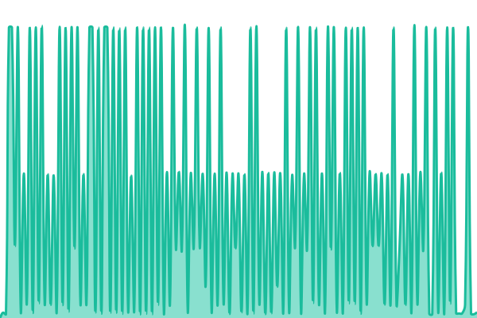
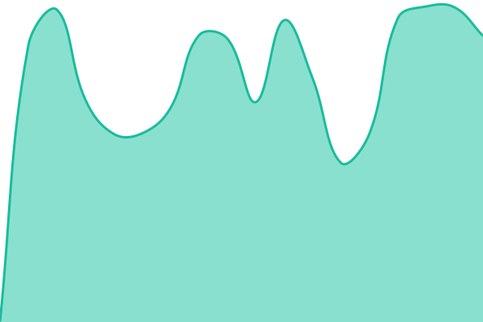
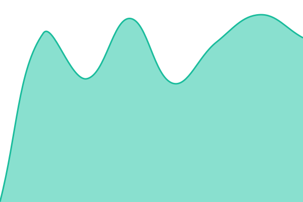
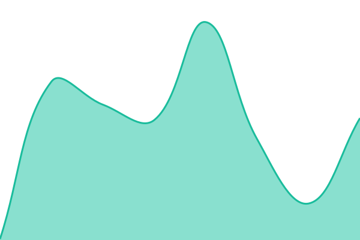

# [📈 Live Status](https://planetarium.github.io/nine-chronicles-status): <!--live status--> **🟧 Partial outage**

This repository contains the open-source uptime monitor and status page for [Planetarium](https://planetariumhq.com/), powered by [Upptime](https://github.com/upptime/upptime).

With [Upptime](https://upptime.js.org), you can get your own unlimited and free uptime monitor and status page, powered entirely by a GitHub repository. We use [Issues](https://github.com/planetarium/nine-chronicles-status/issues) as incident reports, [Actions](https://github.com/planetarium/nine-chronicles-status/actions) as uptime monitors, and [Pages](https://planetarium.github.io/nine-chronicles-status) for the status page.

<!--start: status pages-->
<!-- This summary is generated by Upptime (https://github.com/upptime/upptime) -->
<!-- Do not edit this manually, your changes will be overwritten -->
<!-- prettier-ignore -->
| URL | Status | History | Response Time | Uptime |
| --- | ------ | ------- | ------------- | ------ |
|  [Odin RPC 1](https://odin-rpc-1.nine-chronicles.com/graphql) | 🟩 Up | [odin-rpc-1.yml](https://github.com/planetarium/nine-chronicles-status/commits/HEAD/history/odin-rpc-1.yml) | 

 523ms
     
 | 

<a href="https://planetarium.github.io/nine-chronicles-status/history/odin-rpc-1">100.00%</a>
    

|  [Odin RPC (9capi 5)](https://odin5.9capi.com/graphql) | 🟩 Up | [odin-rpc-9capi-5.yml](https://github.com/planetarium/nine-chronicles-status/commits/HEAD/history/odin-rpc-9capi-5.yml) | 

 543ms
     
 | 

<a href="https://planetarium.github.io/nine-chronicles-status/history/odin-rpc-9capi-5">97.19%</a>
    

|  [Odin RPC (9capi 6)](https://odin6.9capi.com/graphql) | 🟩 Up | [odin-rpc-9capi-6.yml](https://github.com/planetarium/nine-chronicles-status/commits/HEAD/history/odin-rpc-9capi-6.yml) | 

 546ms
     
 | 

<a href="https://planetarium.github.io/nine-chronicles-status/history/odin-rpc-9capi-6">100.00%</a>
    

|  [Odin Validator 5](https://odin-validator-5.nine-chronicles.com/graphql) | 🟩 Up | [odin-validator-5.yml](https://github.com/planetarium/nine-chronicles-status/commits/HEAD/history/odin-validator-5.yml) | 

 517ms
     
 | 

<a href="https://planetarium.github.io/nine-chronicles-status/history/odin-validator-5">100.00%</a>
    

|  [Heimdall RPC 1](https://heimdall-rpc-1.nine-chronicles.com/graphql) | 🟩 Up | [heimdall-rpc-1.yml](https://github.com/planetarium/nine-chronicles-status/commits/HEAD/history/heimdall-rpc-1.yml) | 

 529ms
     
 | 

<a href="https://planetarium.github.io/nine-chronicles-status/history/heimdall-rpc-1">100.00%</a>
    

|  [Heimdall RPC 2](https://heimdall-rpc-2.nine-chronicles.com/graphql) | 🟥 Down | [heimdall-rpc-2.yml](https://github.com/planetarium/nine-chronicles-status/commits/HEAD/history/heimdall-rpc-2.yml) | 

 467ms
     
 | 

<a href="https://planetarium.github.io/nine-chronicles-status/history/heimdall-rpc-2">0.00%</a>
    

|  [Heimdall RPC (9capi 6)](https://heimdall6.9capi.com/graphql) | 🟥 Down | [heimdall-rpc-9capi-6.yml](https://github.com/planetarium/nine-chronicles-status/commits/HEAD/history/heimdall-rpc-9capi-6.yml) | 

 560ms
     
 | 

<a href="https://planetarium.github.io/nine-chronicles-status/history/heimdall-rpc-9capi-6">100.00%</a>
    

|  [Heimdall Validator 1](https://heimdall-validator-1.nine-chronicles.com/graphql) | 🟩 Up | [heimdall-validator-1.yml](https://github.com/planetarium/nine-chronicles-status/commits/HEAD/history/heimdall-validator-1.yml) | 

 655ms
     
 | 

<a href="https://planetarium.github.io/nine-chronicles-status/history/heimdall-validator-1">100.00%</a>
    

|  [Planet Registry](https://planets.nine-chronicles.com/planets/) | 🟩 Up | [planet-registry.yml](https://github.com/planetarium/nine-chronicles-status/commits/HEAD/history/planet-registry.yml) | 

 136ms
     
 | 

<a href="https://planetarium.github.io/nine-chronicles-status/history/planet-registry">100.00%</a>
    

<!--end: status pages-->

[**Visit our status website →**](https://planetarium.github.io/nine-chronicles-status)

## 📄 License

- Powered by: [Upptime](https://github.com/upptime/upptime)
- Code: [MIT](./LICENSE) © [Anand Chowdhary](https://anandchowdhary.com), supported by [Pabio](https://pabio.com)
- Data in the `./history` directory: [Open Database License](https://opendatacommons.org/licenses/odbl/1-0/)
